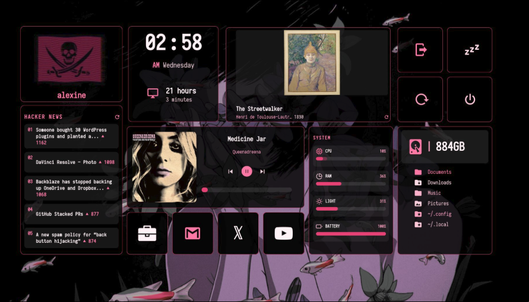

# Dashboard

This README was updated by an LLM friend.

This dashboard is a customized version of the original `adi1090x/widgets`
EWW dashboard. The layout and visuals were reworked to fit a darker,
pink-accented desktop setup while keeping the original EWW structure.

## What Changed

- Replaced the original weather/quote-style area with an art widget.
- Added a Hacker News widget with the top stories, ranks, links, and a refresh button.
- Removed the old concept/word widget.
- Moved Hacker News into the left column where the concept widget used to be.
- Reworked the system widget for the larger right-side slot.
- Added clearer system cards for CPU, RAM, brightness, and battery.
- Kept the clock, uptime, music, quick links, power buttons, folders, and profile widgets.
- Cleaned unused files, old concept scripts, old weather scripts, app-grid assets, and Python cache files.

## Visual Changes

- Changed the theme from the original Nord-style dashboard to a black and pink palette.
- Main background uses transparent/black glass-style widgets.
- Accent color is pink/magenta, mostly around `#e93f77` and `#ff78a6`.
- Text uses pale pink and white tones for contrast.
- Widgets use thin pink borders and rounded corners.
- Hacker News text was made larger for readability.
- System cards were tightened and vertically aligned to reduce empty space.
- Power icons were switched to Nerd Font icons and enlarged.

## Widgets Included

- Profile
- Clock with uptime
- Music player
- Art of the day
- Hacker News
- System metrics
- Quick links
- Power controls
- Folders / disk free space

## Notes

- The display name is set to `YOUR NAME` in `eww.yuck`.
- The dashboard expects to live at `~/.config/eww/dashboard` when installed.
- Some scripts expect common desktop tools such as `eww`, `firefox`, `brave`,
  `nautilus`, `mpc`, `brightnessctl`, and `systemctl`.
- The layout is tuned for the author's Hyprland laptop setup, so monitor names
  and geometry may need adjustment on another machine.
